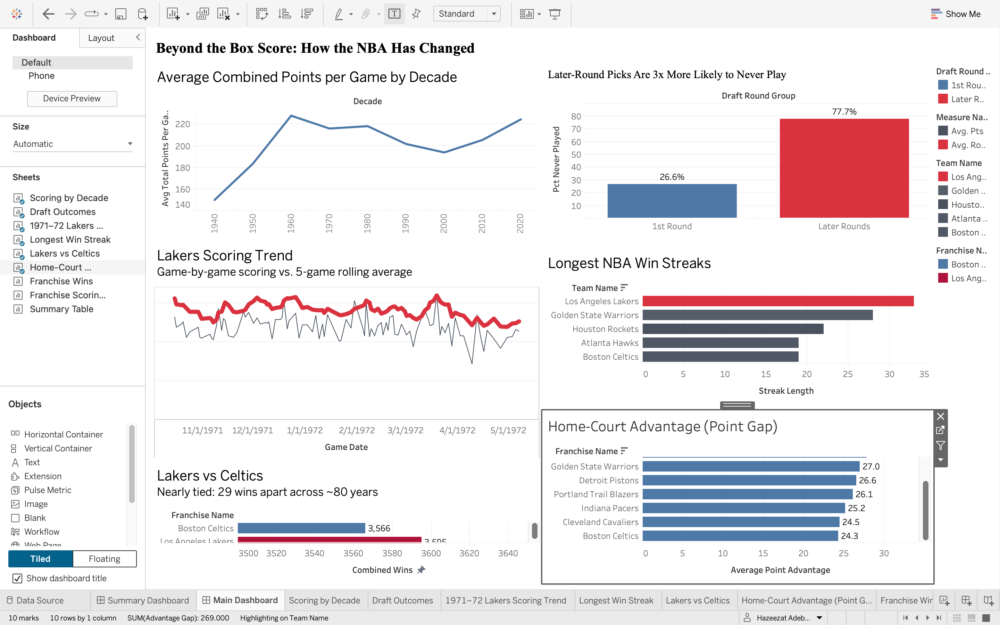

# Beyond the Box Score: How the NBA Has Changed

**An investigation into 77 years of NBA history — how the game changed, how difficult talent is to predict, and what sustained dominance looks like.**

## The Question

Basketball in 1946 was a very different game from the NBA we watch today. But what actually changed? Not just the players, but how the game is scored, how teams identify talent, and what sustained dominance looks like.

I analyzed 64,000+ NBA games and thousands of draft records from 1946–2023 to investigate three questions.

## Chapter 1: The Game Changed

**How has scoring evolved across NBA history?**

Scoring didn't just rise over time. It went up, down, and back up again.

- **1960s:** the highest of any decade in the data, at about 228 combined points per game
- **2000s:** the low point, at about 194
- **2020s:** back up to about 224 (a partial decade in the data)

The 2020s reach a similar scoring level, but with a shot that barely existed in the 1960s. The three-point line didn't arrive until 1979–80. In the 1990s, the first decade with complete data, teams combined for about 24 three-point attempts per game. By the 2020s that was about 70.

**What patterns accompanied the shifts?** Three-point attempts rose sharply during the same years that scoring recovered, which fits the modern "three-point era." But this analysis shows the pattern, not the cause. And the data has no shot or pace information for the 1960s, so it can show that scoring peaked then, but not why.

## Chapter 2: Talent Is Uncertain

**How strongly does draft position predict whether a player ever reaches the NBA?**

- **First-round picks:** 73.4% appeared in an NBA game
- **Later-round picks:** 22.3% did

Draft position is strongly associated with the likelihood that a player appears in an NBA game. Even among first-round selections, more than 1 in 4 never appeared in an NBA game.

**Caveat:** "appeared in an NBA game" is the only success measure available here. It says nothing about career length, performance, or stardom. The early NBA also had far fewer roster spots, so some of the gap may reflect the era, not just draft position.

## Chapter 3: What Does Sustained Dominance Look Like?

The 1971–72 Los Angeles Lakers won 33 consecutive games, the longest winning streak identified in this dataset. The next longest is 28, by the Golden State Warriors, and that streak stretched across two seasons.

During the Lakers' streak (November 5, 1971 to January 7, 1972), they averaged about 123 points per game, compared with about 116 in the rest of their games that year (playoff games included, which tend to be lower-scoring). Their scoring then fell in the final weeks of the season.

A winning streak belongs to a specific team and season, not to a franchise's whole history, so this chapter is analyzed at the team-era level.

## Additional Findings

Three additional findings help put the main story in context:

- **All-time wins:** the Lakers lead with 3,595 combined regular-season and playoff wins, just ahead of the Celtics at 3,566. But the Celtics lead in regular-season wins alone (3,210 vs 3,193), so "greatest franchise" depends on how you define success.
- **Home-court advantage:** the Atlanta Hawks show the biggest gap, winning about 65% of home games versus about 35% away.
- **Highest-scoring franchise:** the Phoenix Suns average about 108 points per game.

## Why It Matters

A single metric rarely tells the whole story. Franchise rankings change depending on how success is defined, scoring averages can hide the forces behind them, and draft position does not guarantee an NBA career. The value of historical analysis is not simply finding the biggest number. It's understanding what that number measures, how it changes across contexts, and where the data stops being able to answer the question.

## Explore the Full Analysis

- **[Interactive Tableau Dashboard →](https://public.tableau.com/app/profile/hazeezat.adebimpe.adebayo/viz/BeyondtheBoxScoreHowtheNBAHasChanged/SummaryDashbaord)** — start on the Summary tab for the quick take, or explore the Main Dashboard for the full story
- **[Full SQL & Python Notebook →](NBA_Historical_Analysis.ipynb)** *(queries, methodology, and code)*

## About the Data

Source: Kaggle NBA database (SQLite), covering games, teams, players, and draft history from 1946 to 2023. Data was extracted with SQL, analyzed in Python, and visualized in Tableau Public. Franchises were consolidated by team ID to account for relocations and name changes (for example, the Minneapolis and Los Angeles Lakers).

## Tools

SQL (SQLite) · Python (Pandas, Matplotlib) · Tableau Public · Jupyter Notebook · GitHub

## Limitations

- The dataset ends in 2023, and the 2020s are only a partial decade.
- The 1940s have a small sample, so early-decade comparisons should be read with care.
- Three-point and turnover data are largely unavailable before 1980.
- Three-point attempts increased alongside the modern scoring resurgence, but this analysis does not establish causation.
- Franchise win totals differ slightly from some outside sources, likely due to how each source counts early games, relocations and playoffs.
- Draft success is measured only by whether a player appeared in an NBA game.
- Scoring figures are combined points for both teams in a game, not per-team averages.
- The Lakers scoring comparison includes playoff games in the "rest of the season" group.

## Project Structure

    NBA-Historical-Performance-Analysis/
    ├── NBA_Historical_Analysis.ipynb
    ├── nba_analysis.sql
    ├── README.md
    └── (CSV exports and chart images)

## Author

Hazeezat Adebayo | Data Analyst | SQL · Python · Tableau
